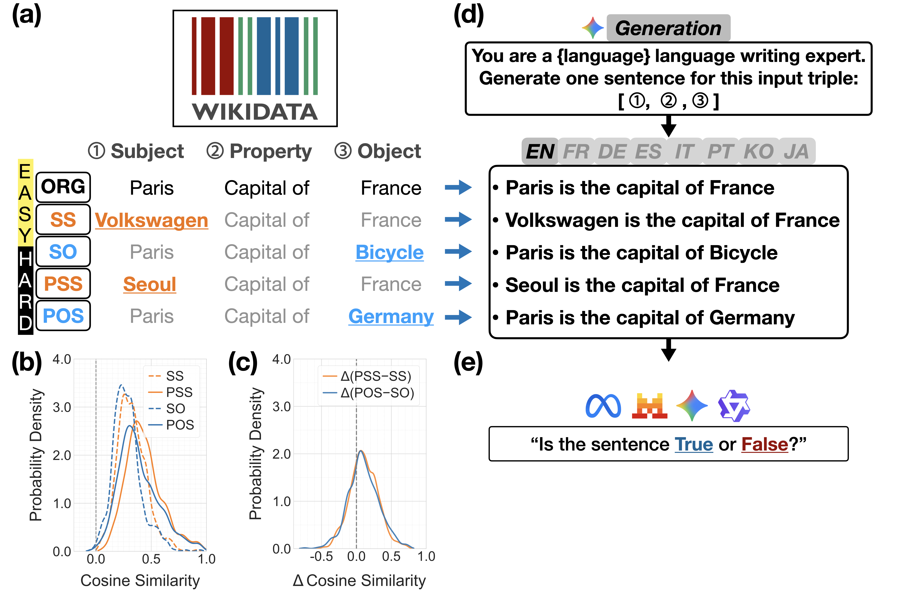

# SWORD: Systematic Wikidata-based Object-Relation Distortion for Evaluating Cross-Lingual Bias in LLM Factual Accuracy

This repository provides code and resources for constructing and evaluating **SWORD**, a multilingual benchmark derived from Wikidata triples with systematically introduced factual distortions.
SWORD is designed to evaluate **factual robustness and cross-lingual consistency** of large language models across multiple languages.

## Overview
<p align="center">
  
</p>

---

## Repository Structure

```
SWORD/
├── 00.data/        # Small processed datasets (≤100MB, tracked)
├── 01.models/      # Model checkpoints (NOT tracked; downloaded separately)
├── 02.results/     # Generated results, figures, and tables (partially tracked)
├── 03.notebooks/   # Data construction, inference, and analysis notebooks
├── environment.yml # Conda environment specification
└── README.md
```
---

## Environment Setup

### Conda Environment

We provide a Conda environment specification to reproduce the **Python-level dependencies** used in this project.

> **Important**
> `environment.yml` does **not** manage system-level dependencies such as CUDA or NVIDIA drivers. These must be installed separately.

---

## Tested Configuration

### Computational Setup

* **Statement generation**: Gemini-2.5-Flash API
* **Local model evaluation** (LLaMA 3.1, Mistral Nemo, Qwen3):
  Conducted using **vLLM** on a system with:

  * 6 × NVIDIA GeForce RTX 4090 GPUs (24GB VRAM each)
  * Dual Intel Xeon Gold 6326 CPUs
  * 1TB DDR4 ECC memory
* **Knowledge graph embedding (node2vec)**:
  CPU-based computation on the same system, implemented using **Gensim (`models.word2vec`)**

**Representative environment**

* OS: Ubuntu 22.04 LTS (x86_64)
* CUDA version (torch): 12.8
* NVIDIA Driver Version: 560.35.03  
* PyTorch: 2.9.0+cu128
* Multi-GPU: 6 GPUs visible

---
## Data

### Wikidata Dump

Raw Wikidata dumps are **not included** due to size.

* **Dump retrieved**: September 16, 2024
* **Data coverage**: up to September 11, 2024
* **Official download page**:
  [https://dumps.wikimedia.org/wikidatawiki/](https://dumps.wikimedia.org/wikidatawiki/)

> Using a different Wikidata snapshot may result in differences in extracted triples and benchmark statistics.

---

### What is included vs. not included

### Included (tracked in this repository)

* **Small processed datasets (≤ 100MB in total)** under `00.data/`
* Jupyter notebooks under `03.notebooks/` for data construction, inference, and analysis
* Conda environment specification (`environment.yml`)
* Selected lightweight results and figures under `02.results/`

### Not included (excluded due to size constraints)

* **Hugging Face model checkpoints**
* **Raw Wikidata dumps**
* **Large intermediate artifacts** generated during extraction, merging, embedding, and inference

> This repository is structured to ensure **full reproducibility**, while requiring users to download or regenerate large artifacts locally.

---

## External Dependencies (Not Included)

### Hugging Face Models

Model checkpoints are **not included** in this repository and must be downloaded manually from Hugging Face.

**Models used in this study**

* `meta-llama/Llama-3.1-8B-Instruct`
* `mistralai/Mistral-Nemo-Instruct-2407`
* `Qwen/Qwen3-8B`
* `Qwen/Qwen3-14B`

> Some models may require Hugging Face authentication. Use `huggingface-cli login` if needed.

---

## SWORD benchmark Construction Pipeline

Large intermediate files are generated step-by-step using notebooks under `03.notebooks/`.

1. **Raw extraction**

   * `03.notebooks/00.wikidata_extract.ipynb`

2. **Triple merging and filtering**

   * `03.notebooks/01.wikidata_merge.ipynb`

3. **Template construction and perturbations**

   * `03.notebooks/03.wikidata_template.ipynb`

4. **Benchmark generation**

   * Subsequent notebooks under `03.notebooks/`

Intermediate outputs are saved under `00.data/` and are **not fully tracked** in Git.

---

## Running Inference and Evaluation

* **Hugging Face inference**

  * `03.notebooks/07.HFmodels_response.ipynb`
* **Labeling and evaluation**

  * `03.notebooks/10.WikiBench_HF_Model_TF.ipynb`
* **Analysis and visualization**

  * `03.notebooks/11.Analysis_HF_Model_TF.ipynb`

Random seeds are fixed where applicable, but GPU parallelism and CUDA kernels may introduce minor non-determinism.

---

## Results and Figures

* Generated outputs are stored under `02.results/`
* A dedicated directory is used for cleaned figures

> **Note**
> Some notebooks may save figures to different subdirectories under "02.results/" depending on execution paths or working directories.
> Users may need to adjust output paths (e.g., `RESULT_DIR`, `FIGURE_DIR`) when reproducing figures.

---

## License

This project adopts a dual license strategy to ensure maximum accessibility and reproducibility.

**Code**
The source code of this repository (SWORD) is licensed under the [MIT License](LICENSE).

**Dataset**
The SWORD dataset is derived from Wikidata and is licensed under the [Creative Commons Attribution 4.0 International (CC BY 4.0)](https://creativecommons.org/licenses/by/4.0/) license.

**Disclaimer**
This dataset is based on [Wikidata](https://www.wikidata.org/), which is available under the [CC0 1.0 Universal Public Domain Dedication](https://creativecommons.org/publicdomain/zero/1.0/).
The authors do not claim ownership of the original Wikidata content.